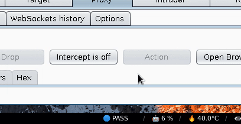

# Burp heads-up display - toggle Burp proxy from anywhere and get its status

These scripts allow to display the current status for the Burp proxy
(`INTERCEPT` or `PASS`) in the notification bar, and toggle it with a global
keyboard shortcut **even when the Burp window is not active**.

I've created it for the `i3` window manager and `i3blocks`, but the same
codebase can be adapted to other GUI with a simple HTTP API.



## Installation

_Prerequisites: Burp Community or Burp Pro 2024.7+_

1. Download the Burp extension (`burpheadsup-x.x.x.jar`) and the script (`burpheadsup.py`) from [latest release](https://github.com/romainricard/burp-headsup/releases)
2. `chmod u+x burpheadsup.py`
3. In Burp, go to Extender > Extensions > Add, and select `burpheadsup-<version>.jar`;
4. In the `i3blocks` config file, set a new block with the following:

```
[burp]
command=/PATH/TO/burpheadsup.py --get-status
signal=12
```

Edit the `signal` value if it is already used by `i3blocks` or another program,
and change `SIGNAL_NB` in `burpheadsup.py`.

6. In the `i3` config file, set the following:

```
bindsym YOUR+SHORTCUT exec /PATH/TO/burpheadsup.py --toggle
```

For instance, I set `bindsym Mod4+a exec /foo/bar/burpheadsup.py --toggle`

6. Reload `i3`, and test your shortcut. If it seems to fail sometimes, see _Calibration_.

## Caveats

If you toggle the proxy from the Burp interface, clicking the "Intercept is off"
button like it's 1963, the displayed status will get desynchronized. It will
update when you'll use your keyboard shortcut again.

## Third-party clients

The Burp extension exposes an HTTP API on `localhost:47674` that you can use with any other clients to control the Burp proxy.
The available routes are:

- `/server/status`: always returns `running` when Burp is running and the extension is loaded without errors
- `/intercept/status`: returns the current proxy status (`intercept` or `pass`)
- `/intercept/enable`: enable intercept
- `/intercept/disable` disable intercept
- `/intercept/toggle` : toggle the proxy intercept feature

All responses are returned in JSON (`{"status": "<status>"}`).

## License

Copyright (C) 2020 Romain RICARD <contact+burpheadsup@romainricard.fr>

This program is free software: you can redistribute it and/or modify
it under the terms of the GNU General Public License as published by
the Free Software Foundation, either version 3 of the License, or
(at your option) any later version.

This program is distributed in the hope that it will be useful,
but WITHOUT ANY WARRANTY; without even the implied warranty of
MERCHANTABILITY or FITNESS FOR A PARTICULAR PURPOSE. See the
GNU General Public License for more details.

See [LICENSE.md](LICENSE.md) for details.
